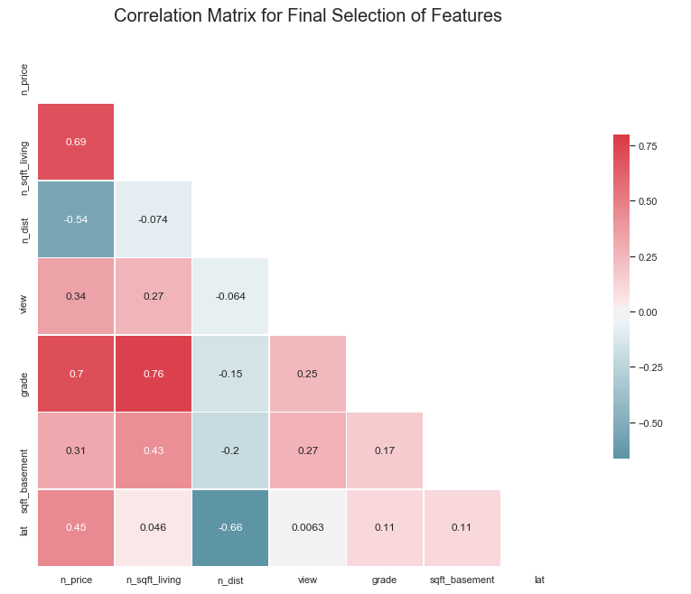
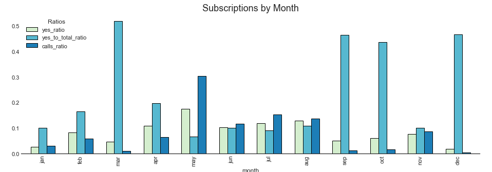

# Modeling Projects

This repository contains notebooks for modeling projects on toy datasets that I did to explore statistical modeling using python.

----------------------------------------
# Decisions & Hypotheses

> [Notebook: Making Decisions with Data](https://github.com/DanyalAndriano/modeling_projects/blob/master/decisions_hypotheses/Northwind_Project_Final_Project_Notebook.ipynb) (Hypothesis Testing, Interaction Effects, Effect Sizes, Group Comparisons, Inference, Decision_Making)

Using the Northwind database--a free, open-source dataset created by Microsoft containing data from a fictional company, I wanted to use statistical modeling to try and answer specific questions about whether or not the company should be giving discounts on their products, which products to discount (in which region) and if so - how much discount? Overall predictive accuracy wasn't the aim, but rather using OLS regression for group comparisons, interactions and effect sizes (OLS is in fact more flexible and robust than ANOVA). 

These questions were quite challenging to answer due to limited data -- however, this perhaps made the task of having to decide on what actions to take realistic for some companies.

 
 
------------------------------------------------
# Predicting the Housing Market

> [Notebook: Predicting the Housing Market](https://github.com/DanyalAndriano/modeling_projects/blob/master/predicting_housing/King_housing_project.ipynb) (Predictive Modeling, Linear Regression, Feature Engineering, Feature Importance)

Linear regression was used to try and predict housing prices. While overall predictive accuracy wasn't bad - 82% - the aim of the project was also to find those features most important to price increases/decrease in the housing market. 

Had this been a real-life project I would furthermore compare results to other machine learning algorithms (especially non-linear algorithms that could still give feature importances - like Random Forests or XGBoost). There are also additions to a regression analysis that could improve results - random effects modeling, polynomial regression, etc. 

----------------------------------------------------------
# Predicting Subscribers

> [Notebook: Predicting banking subscribers](https://github.com/DanyalAndriano/modeling_projects/blob/master/bank_subscriptions/classifier_bank_marketing.ipynb) (Class Imbalance, Resampling, ML Pipelines,)

> [Notebook: Feature EDA](https://github.com/DanyalAndriano/modeling_projects/blob/master/bank_subscriptions/eda_bank_marketing.ipynb) (Feature Engineering, Seasonality, Follow up Questions)

This is a classic dataset used to try and predict subscribers (for term deposits). I grappled a lot with the class imbalance in the dataset. Looking back on the project now, the major changes I would add are - working more with the probabilistic outputs (especially using ranking to target those most likely to subscribe first - so basically, _applying_ the findings in an effective way to the business problem). I would also carry out more group comparisons - e.g., do subscribers differ by season? Etc. Feature engineering and optimized gridsearch techniques could also improve performance. Nevertheless, the project still outlines a good approach to the problem.    

