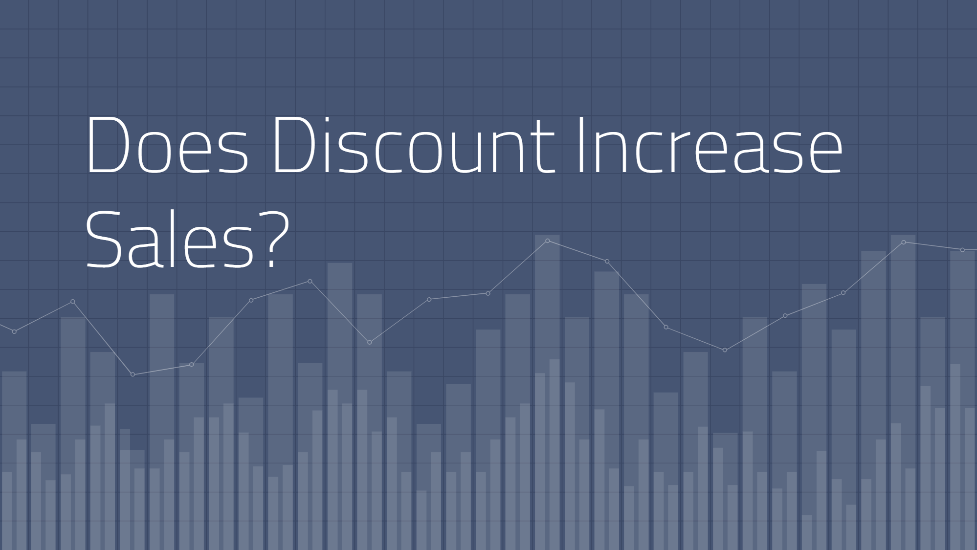
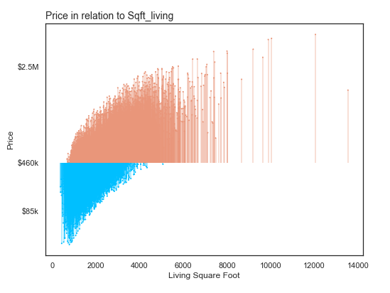

# Modeling Projects

This repository contains notebooks for modeling projects on toy datasets that I did to explore statistical modeling using python.

----------------------------------------
# Decisions & Hypotheses

Using the Northwind database--a free, open-source dataset created by Microsoft containing data from a fictional company, I wanted to use statistical modeling to try and answer specific questions about whether or not the company should be giving discounts on their products, which products to discount (in which region) and if so - how much discount?

These questions were quite challenging to answer due to limited data -- however, this perhaps made the task of having to decide on what actions to take realistic for some companies.

 
 
------------------------------------------------

# Predicting the Boston Housing Market

I used linear regression to predict the Boston housing market. While I got a decent R-squared (.82) - I would definitely not have stopped my analysis here if this were a real project I was working on. I would definitely use other machine learning algorithms - like XGBoost, Random Forests. There are improvements and follow ups that can be made to the regression analysis as well - which I've documented at the end of the project notebook. 

What was important in this project was predictive value but also perhaps understanding what drives price. Regression analysis offers the advantage of understanding which features impact the predictions the most, and even whether the relationship to the outcomes variable is positive (increases price) or negative (decreases price).

